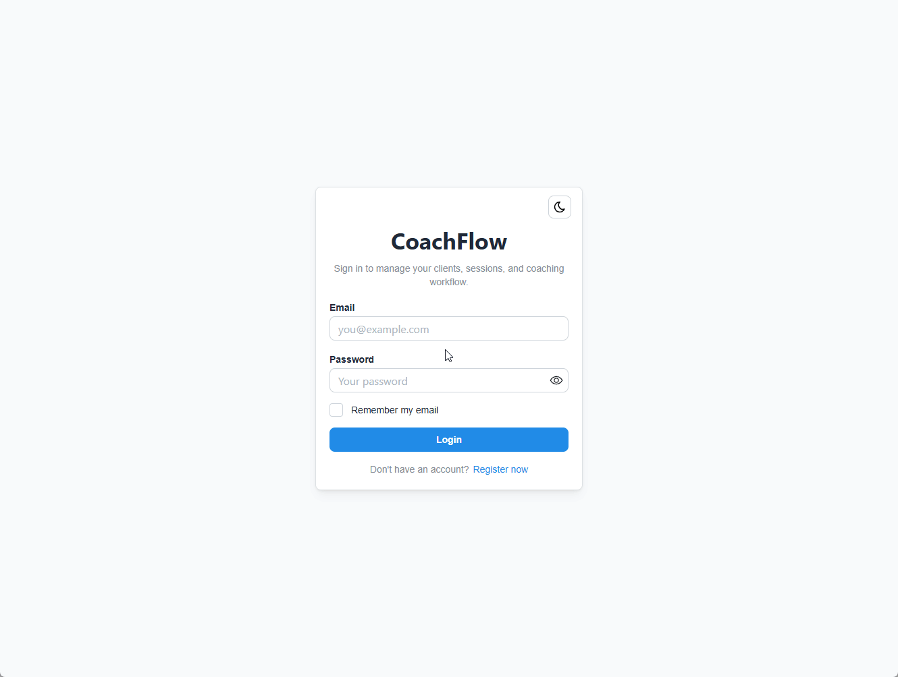
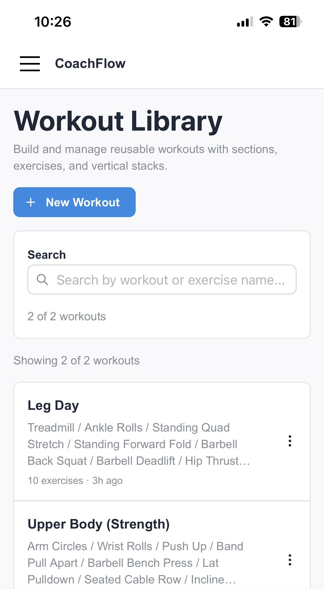
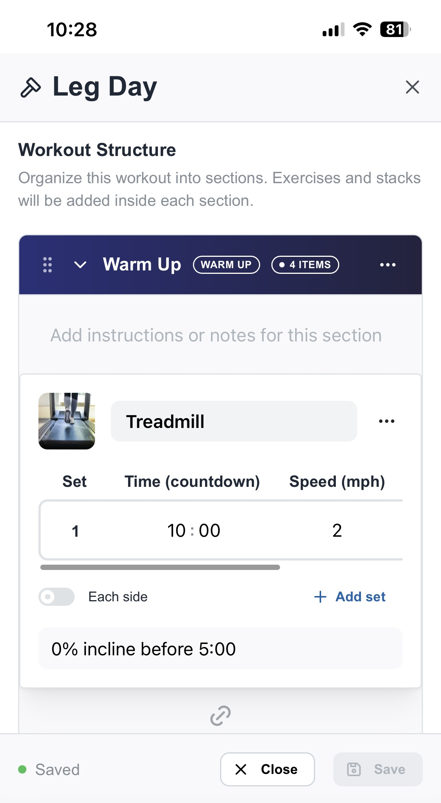
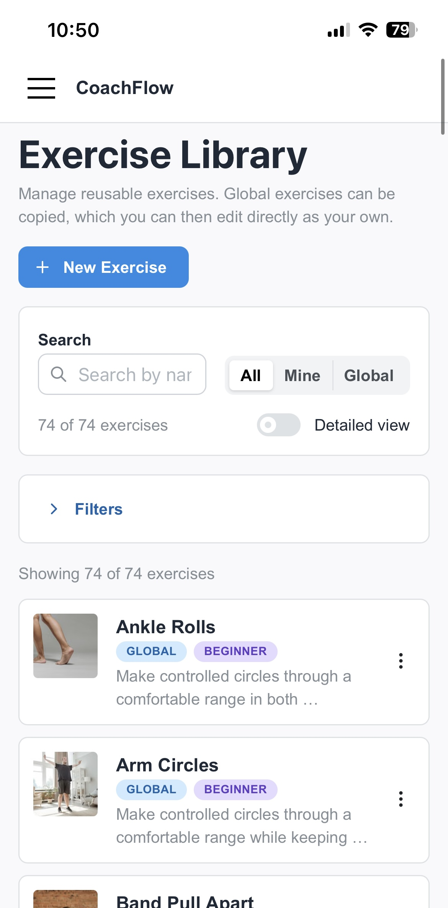
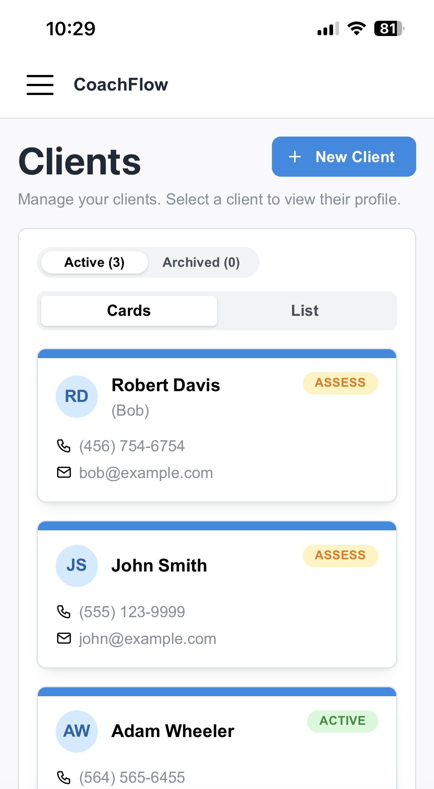
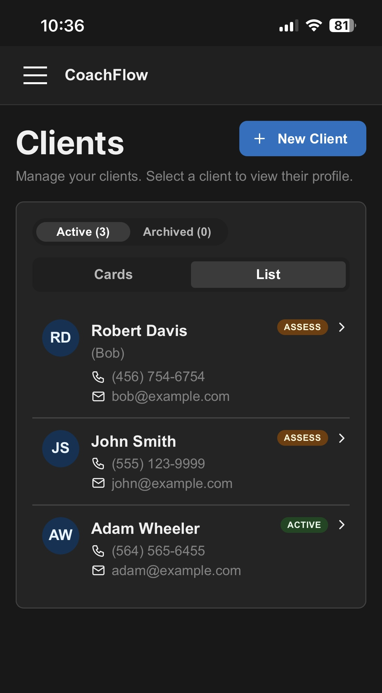
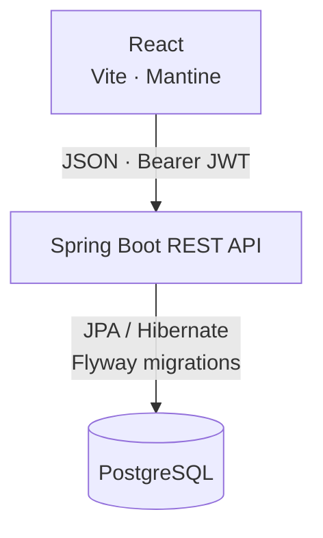

# CoachFlow

> An actively developed, full-stack personal trainer management application for organizing clients, onboarding workflows, reusable exercise libraries, and structured workout templates in one place.

[**Explore the live development build**](https://coachflow.jacobnh.com) · [**Run locally**](#local-development)

The live development build supports trainer registration and provides each account with an isolated workspace.

CoachFlow is being designed and tested in collaboration with a working personal trainer. It is an active product build rather than a finished SaaS application: the current focus is giving trainers a clean, responsive workspace for client onboarding and workout design, while the next phases expand into assessments, programs, and recorded live-session results.

---

## Highlights

> Each workflow below can be expanded for implementation details and supporting media. The workout builder is open by default because it is the most developed part of the current product experience.

<details open>
<summary><strong>Workout template builder</strong> — Build reusable workouts with sections, stacks, configurable targets, and local draft recovery</summary>

- Reusable workout templates with sections such as warm-up, strength, cardio, mobility, and cooldown
- Individual exercises plus structured supersets, trisets, and circuits
- Configurable target tables for reps, weight, time, distance, speed, incline, height, resistance, RPE, rest, and notes
- Support for regular, warm-up, drop, and failure set types
- Create, edit, copy, archive, and locally recover in-progress workout drafts


<p align="center">
  
</p>

<p align="center">
  
</p>

<p align="center">
  
</p>

</details>
<br>
<details>
<summary><strong>Client management and onboarding</strong> — Create client records, complete structured intakes, and resume work later</summary>

- Create, update, and browse client records in card or table/list views
- Client review indicators prioritize unfinished onboarding work
- Multi-step intake workflow covering basic information, PAR-Q, goals, activity history, medical history, lifestyle, and training preferences
- Incremental intake saving, exit confirmation, and resume-later support

<p align="center">
  
</p>

<p align="center">
  
</p>

</details>
<br>
<details>
<summary><strong>Exercise library</strong> — Maintain reusable global and trainer-owned exercises with searchable metadata</summary>

- Reusable global and trainer-owned exercises
- Global exercises can be copied into a trainer-owned version for editing
- Search, filtering, metadata badges, thumbnail URLs, and demonstration-video links
- Exercise metadata for difficulty, equipment, primary muscles, and tags
- Archive workflow for trainer-owned exercises

<p align="center">
  
</p>

</details>
<br>
<details>
<summary><strong>Secure trainer workspaces</strong> — Authenticated, trainer-scoped data access across the application</summary>

- Self-service trainer registration and sign-in
- Stateless bearer-token authentication with JWTs
- Passwords hashed with BCrypt and validated by the backend
- Trainer ownership is resolved from the authenticated identity—not trusted from client-supplied IDs
- Clients, intakes, custom exercises, and workout templates are scoped to the signed-in trainer

<p align="center">
  
</p>

</details>
<br>
<details>
<summary><strong>Responsive product UI</strong> — Desktop and mobile workflows built around the same trainer experience</summary>

- React Router routes for direct navigation and recoverable editor state
- Mantine-based desktop and mobile layouts with light and dark modes
- Mobile-friendly drawers for exercise and workout editing flows
- Persistent client display preferences and workout draft recovery where it improves the workflow

<p align="center">
  
</p>

<p align="center">
  
</p>

<p align="center">
  
</p>

<p align="center">
  
</p>

<p align="center">
  
</p>


</details>

---

## Architecture



The frontend is a React single-page application with route-based navigation and reusable, feature-oriented UI. The backend exposes a REST API, owns validation and authorization, and persists the core trainer, client, intake, exercise, and workout-template domains in PostgreSQL.

The workout builder uses a nested template model:

```text
Workout Template
  └── Sections
        └── Items
              ├── Exercise
              ├── Superset
              ├── Triset
              └── Circuit
                    └── Configurable exercise targets and tracking fields
```

---

## Tech stack

| Area | Technologies |
| --- | --- |
| Languages | Java 21, JavaScript |
| Backend | Spring Boot, Spring Web, Spring Security, Spring Data JPA, Bean Validation |
| Database | PostgreSQL, Flyway, Hibernate |
| API documentation | OpenAPI / Swagger UI |
| Frontend | React, Vite, React Router |
| UI | Mantine, Tabler Icons |
| Local development & tooling | Docker Compose, DBeaver, Gradle, npm, ESLint |

---

## Security notes

CoachFlow's protected API boundaries are designed around the authenticated trainer rather than IDs supplied by the browser:

- Application data routes require an authenticated bearer JWT; registration and login are the public authentication flows.
- Backend services resolve the current trainer from the token before loading or modifying trainer-owned records.
- Cross-trainer record access returns no accessible data rather than relying on frontend filtering.
- Registration password requirements are validated on both the client and the API.
- Secrets and environment-specific configuration are excluded from version control.

---

## Local development

This repository documents the current development stack rather than a generic, turnkey product installation. The following is enough to run the application locally.

### Prerequisites

- Java 21
- Node.js and npm
- PostgreSQL 16, or Docker for the included local PostgreSQL container

### 1. Start PostgreSQL

```bash
cd backend
docker compose up -d
```

The included compose configuration starts a local PostgreSQL database on port `5432`.

### 2. Configure and run the backend

Set the required environment variables before starting Spring Boot:

```text
SPRING_DATASOURCE_USERNAME=coachflow_user
SPRING_DATASOURCE_PASSWORD=coachflow_pass
COACHFLOW_JWT_SECRET=<Base64-encoded secret containing at least 32 bytes>
COACHFLOW_SERVER_ADDRESS=127.0.0.1
```

Then run:

```bash
cd backend
./gradlew bootRun
```

Flyway applies database migrations automatically at startup. Local Swagger UI is available at:

```text
http://localhost:8080/swagger-ui/index.html
```

### 3. Configure and run the frontend

Create a local frontend environment file from the example, set the API base URL, then start Vite:

```bash
cd frontend
cp .env.example .env.local
npm install
npm run dev
```

For a standard local API setup, set `VITE_API_BASE_URL` to `http://localhost:8080` in `.env.local`. `VITE_MEDIA_BASE_URL` can remain pointed at an appropriate media host for thumbnail paths that use the `media/` prefix.

### Checks

```bash
# Backend
cd backend
./gradlew test

# Frontend
cd frontend
npm run lint
npm run build
```

---

## Project structure

```text
backend/
  src/main/java/com/stugger/coachflow/
    api/             REST controllers, request/response DTOs, error handling
    config/          application, security, JWT, and OpenAPI configuration
    entity/          JPA domain entities
    repository/      persistence access
    security/        current-trainer resolution and JWT services
    service/         business rules and trainer-scoped workflows
  src/main/resources/db/migration/
    Flyway database migrations

frontend/
  src/
    components/      shared application, client, intake, and exercise UI
    features/        workout library and workout builder feature modules
    pages/           route-level application pages
    constants/       route and domain option definitions
    utils/           API client, auth storage, validation, and formatting helpers
```

---

## Roadmap

Current work is focused on expanding the workout-design workflow and building toward program delivery:

- Printable workout templates with browser print / Save as PDF support
- Exercise creation, editing, and copying directly from the workout builder
- Exercise-library domain refactor into a dedicated feature module
- Larger multi-panel workout-builder layout for desktop workflows
- Drag-and-drop reordering for sections, workout items, and stacked exercises
- Measurements, assessments, client program assignments, live workout sessions, and recorded exercise results
- A redesigned calendar and scheduling workflow, including trainer availability and client self-booking links

---

## Status

CoachFlow is actively under development and being refined through ongoing trainer feedback and hands-on testing. The current build establishes the trainer-side foundation for client onboarding and workout design; assessments, programs, live sessions, and expanded scheduling are the next major product areas.

---

## License

This repository is shared for portfolio and reference purposes. All rights reserved.